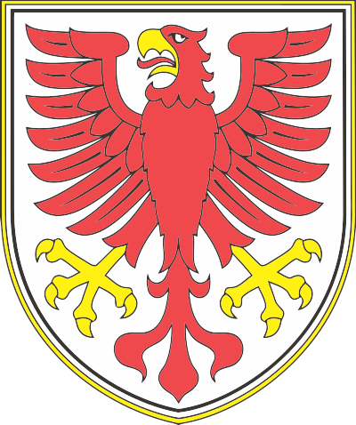
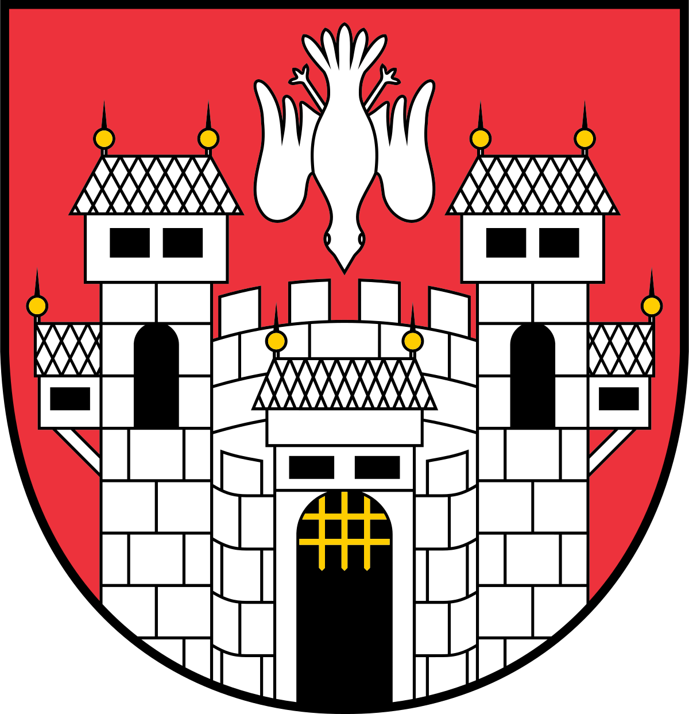
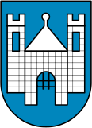
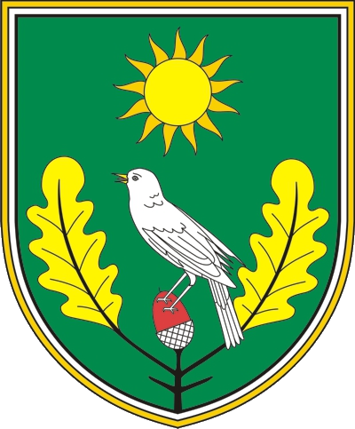
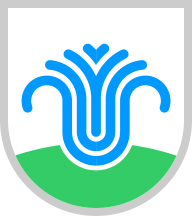
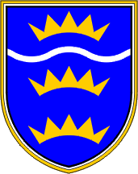
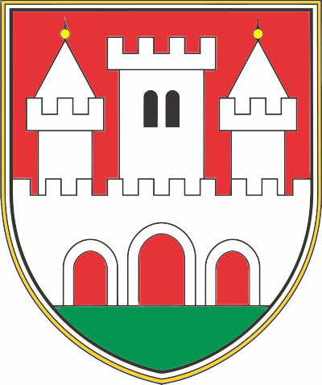
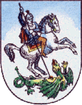
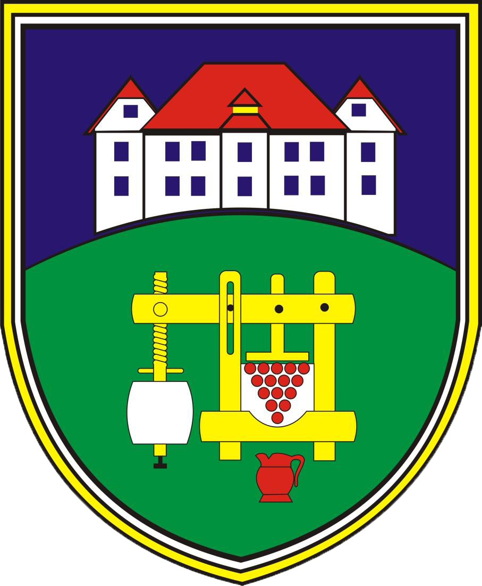
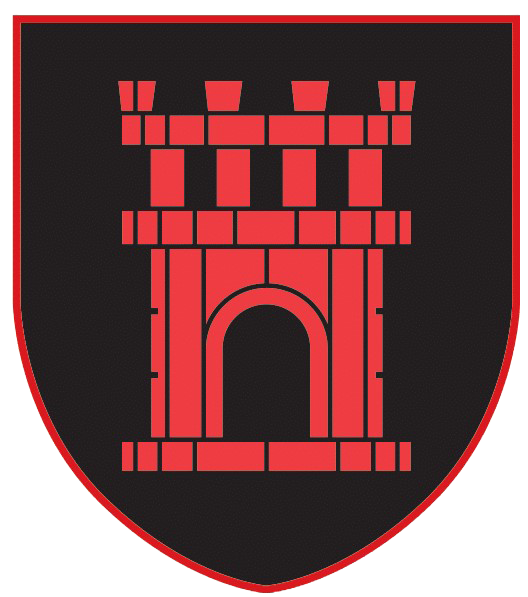

<h4>Zbirka grbov vseh slovenskih občin </h4>
Ta repozitorij vsebuje zbirko grbov vseh 212 slovenskih občin. (02.04.2024)   

Velika večina grbov je pridobljenih iz občinskih spletnih strani, in je licensa za uporabo določena na njihovi strani, povezave so v `index.json`. Nekateri grbi pa so iz [Grboslovje](https://grboslovje.si/meni.php) in spadajo pod njihovo licenso. Sicer pa `CC BY-SA 4.0`.

Če opazite kakšno napako, ali imate boljšo sliko grba, open a pull request.

<i><b>Opomba: grbi lahko vsebujejo napake, zato jih pred uporabo za resne zadeve preverite.</b></i>

<h4>List of all Slovenian Municipal Coats of arms </h4>

This repository contains the coats of arms of all 212 municipalites of Slovenia, as of 02 April 2024.  

Majority of the coats was sourced directly from municipal websites and the usage license is determined on each website respectively, the links to websites are in `index.json`. Some coats are from [Grboslovje](https://grboslovje.si/meni.php) and are licensed accordingly. Otherwise `CC BY-SA 4.0`.

If you spot any errors or find a better quality image, please open a pull request. 

<i>Note: These coats are likely to contain errors, please check thoroughly before using them for serious matters.</i>

<h5>Sammlung der Wappen der slowenischen Gemeinden</h5>

Dieses Repository enthält eine Sammlung der Wappen aller 212 slowenischen Gemeinden (02.04.2024).

Die Mehrheit der Mäntel wurde direkt von kommunalen Websites bezogen, und die Nutzungslizenz ist auf jeder Website festgelegt; die Links zu den Websites sind in der Datei "index.json" enthalten. Einige Mäntel stammen von [Grboslovje] (https://grboslovje.si/meni.php) . Ansonsten `CC BY-SA 4.0`.

Wenn Sie Fehler entdecken oder ein Bild in besserer Qualität finden, öffnen Sie bitte einen Pull Request. 

<i>Hinweis: Diese Mäntel können Fehler enthalten. Bitte überprüfen Sie sie sorgfältig, bevor Sie sie für ernste Angelegenheiten verwenden..</i>

| | | | |
|:-------------------------:|:-------------------------:|:-------------------------:|:-------------------------:|
|  **Šentrupert** Grb občine Šentrupert Coat of arms of Šentrupert Wappen der Gemeinde Šentrupert |  **Koper** Grb občine Koper Coat of arms of Koper Wappen der Gemeinde Koper |  **Kranj** Grb občine Kranj Coat of arms of Kranj Wappen der Gemeinde Kranj |  **Ljubljana** Grb občine Ljubljana Coat of arms of Ljubljana Wappen der Gemeinde Ljubljana |
|  **Maribor** Grb občine Maribor Coat of arms of Maribor Wappen der Gemeinde Maribor |  **Murska Sobota** Grb občine Murska Sobota Coat of arms of Murska Sobota Wappen der Gemeinde Murska Sobota |  **Nova Gorica** Grb občine Nova Gorica Coat of arms of Nova Gorica Wappen der Gemeinde Nova Gorica |  **Novo Mesto** Grb občine Novo Mesto Coat of arms of Novo Mesto Wappen der Gemeinde Novo Mesto |
|  **Ptuj** Grb občine Ptuj Coat of arms of Ptuj Wappen der Gemeinde Ptuj |  **Slovenj Gradec** Grb občine Slovenj Gradec Coat of arms of Slovenj Gradec Wappen der Gemeinde Slovenj Gradec |  **Velenje** Grb občine Velenje Coat of arms of Velenje Wappen der Gemeinde Velenje |  **Ajdovščina** Grb občine Ajdovščina Coat of arms of Ajdovščina Wappen der Gemeinde Ajdovščina |
|  **Ankaran** Grb občine Ankaran Coat of arms of Ankaran Wappen der Gemeinde Ankaran |  **Apače** Grb občine Apače Coat of arms of Apače Wappen der Gemeinde Apače |  **Beltinci** Grb občine Beltinci Coat of arms of Beltinci Wappen der Gemeinde Beltinci |  **Benedikt** Grb občine Benedikt Coat of arms of Benedikt Wappen der Gemeinde Benedikt |
|  **Bistrica ob Sotli** Grb občine Bistrica ob Sotli Coat of arms of Bistrica ob Sotli Wappen der Gemeinde Bistrica ob Sotli |  **Bled** Grb občine Bled Coat of arms of Bled Wappen der Gemeinde Bled |  **Bloke** Grb občine Bloke Coat of arms of Bloke Wappen der Gemeinde Bloke |  **Bohinj** Grb občine Bohinj Coat of arms of Bohinj Wappen der Gemeinde Bohinj |
|  **Borovnica** Grb občine Borovnica Coat of arms of Borovnica Wappen der Gemeinde Borovnica |  **Bovec** Grb občine Bovec Coat of arms of Bovec Wappen der Gemeinde Bovec |  **Braslovče** Grb občine Braslovče Coat of arms of Braslovče Wappen der Gemeinde Braslovče |  **Brda** Grb občine Brda Coat of arms of Brda Wappen der Gemeinde Brda |
|  **Brezovica** Grb občine Brezovica Coat of arms of Brezovica Wappen der Gemeinde Brezovica |  **Brežice** Grb občine Brežice Coat of arms of Brežice Wappen der Gemeinde Brežice |  **Cankova** Grb občine Cankova Coat of arms of Cankova Wappen der Gemeinde Cankova |  **Cerklje na Gorenjskem** Grb občine Cerklje na Gorenjskem Coat of arms of Cerklje na Gorenjskem Wappen der Gemeinde Cerklje na Gorenjskem |
|  **Celje** Grb občine Celje Coat of arms of Celje Wappen der Gemeinde Celje |  **Cerknica** Grb občine Cerknica Coat of arms of Cerknica Wappen der Gemeinde Cerknica |  **Cerkno** Grb občine Cerkno Coat of arms of Cerkno Wappen der Gemeinde Cerkno |  **Cerkvenjak** Grb občine Cerkvenjak Coat of arms of Cerkvenjak Wappen der Gemeinde Cerkvenjak |  **Cirkulane** Grb občine Cirkulane Coat of arms of Cirkulane Wappen der Gemeinde Cirkulane |
|  **Destrnik** Grb občine Destrnik Coat of arms of Destrnik Wappen der Gemeinde Destrnik |  **Divača** Grb občine Divača Coat of arms of Divača Wappen der Gemeinde Divača |  **Dobje** Grb občine Dobje Coat of arms of Dobje Wappen der Gemeinde Dobje |  **Dobrepolje** Grb občine Dobrepolje Coat of arms of Dobrepolje Wappen der Gemeinde Dobrepolje |
|  **Dobrna** Grb občine Dobrna Coat of arms of Dobrna Wappen der Gemeinde Dobrna |  **Dobrova–Polhov Gradec** Grb občine Dobrova–Polhov Gradec Coat of arms of Dobrova–Polhov Gradec Wappen der Gemeinde Dobrova–Polhov Gradec |  **Dobrovnik** Grb občine Dobrovnik Coat of arms of Dobrovnik Wappen der Gemeinde Dobrovnik |  **Dol pri Ljubljani** Grb občine Dol pri Ljubljani Coat of arms of Dol pri Ljubljani Wappen der Gemeinde Dol pri Ljubljani |
|  **Dolenjske Toplice** Grb občine Dolenjske Toplice Coat of arms of Dolenjske Toplice Wappen der Gemeinde Dolenjske Toplice |  **Domžale** Grb občine Domžale Coat of arms of Domžale Wappen der Gemeinde Domžale |  **Dornava** Grb občine Dornava Coat of arms of Dornava Wappen der Gemeinde Dornava |  **Dravograd** Grb občine Dravograd Coat of arms of Dravograd Wappen der Gemeinde Dravograd |
|  **Duplek** Grb občine Duplek Coat of arms of Duplek Wappen der Gemeinde Duplek |  **Gorenja Vas–Poljane** Grb občine Gorenja Vas–Poljane Coat of arms of Gorenja Vas–Poljane Wappen der Gemeinde Gorenja Vas–Poljane |  **Gorišnica** Grb občine Gorišnica Coat of arms of Gorišnica Wappen der Gemeinde Gorišnica |  **Gorje** Grb občine Gorje Coat of arms of Gorje Wappen der Gemeinde Gorje |
|  **Gornja Radgona** Grb občine Gornja Radgona Coat of arms of Gornja Radgona Wappen der Gemeinde Gornja Radgona |  **Gornji Grad** Grb občine Gornji Grad Coat of arms of Gornji Grad Wappen der Gemeinde Gornji Grad |  **Gornji Petrovci** Grb občine Gornji Petrovci Coat of arms of Gornji Petrovci Wappen der Gemeinde Gornji Petrovci |  **Grad** Grb občine Grad Coat of arms of Grad Wappen der Gemeinde Grad |
|  **Grosuplje** Grb občine Grosuplje Coat of arms of Grosuplje Wappen der Gemeinde Grosuplje |  **Hajdina** Grb občine Hajdina Coat of arms of Hajdina Wappen der Gemeinde Hajdina |  **Hodoš** Grb občine Hodoš Coat of arms of Hodoš Wappen der Gemeinde Hodoš |  **Horjul** Grb občine Horjul Coat of arms of Horjul Wappen der Gemeinde Horjul |
|  **Hoče-Slivnica** Grb občine Hoče-Slivnica Coat of arms of Hoče-Slivnica Wappen der Gemeinde Hoče-Slivnica |  **Hrastnik** Grb občine Hrastnik Coat of arms of Hrastnik Wappen der Gemeinde Hrastnik |  **Hrpelje-Kozina** Grb občine Hrpelje-Kozina Coat of arms of Hrpelje-Kozina Wappen der Gemeinde Hrpelje-Kozina |  **Idrija** Grb občine Idrija Coat of arms of Idrija Wappen der Gemeinde Idrija |
|  **Ig** Grb občine Ig Coat of arms of Ig Wappen der Gemeinde Ig |  **Ilirska Bistrica** Grb občine Ilirska Bistrica Coat of arms of Ilirska Bistrica Wappen der Gemeinde Ilirska Bistrica |  **Ivančna Gorica** Grb občine Ivančna Gorica Coat of arms of Ivančna Gorica Wappen der Gemeinde Ivančna Gorica |  **Izola** Grb občine Izola Coat of arms of Izola Wappen der Gemeinde Izola |
|  **Jesenice** Grb občine Jesenice Coat of arms of Jesenice Wappen der Gemeinde Jesenice |  **Jezersko** Grb občine Jezersko Coat of arms of Jezersko Wappen der Gemeinde Jezersko |  **Juršinci** Grb občine Juršinci Coat of arms of Juršinci Wappen der Gemeinde Juršinci |  **Kamnik** Grb občine Kamnik Coat of arms of Kamnik Wappen der Gemeinde Kamnik |
|  **Kanal ob Soči** Grb občine Kanal ob Soči Coat of arms of Kanal ob Soči Wappen der Gemeinde Kanal ob Soči |  **Kidričevo** Grb občine Kidričevo Coat of arms of Kidričevo Wappen der Gemeinde Kidričevo |  **Kobarid** Grb občine Kobarid Coat of arms of Kobarid Wappen der Gemeinde Kobarid |  **Kobilje** Grb občine Kobilje Coat of arms of Kobilje Wappen der Gemeinde Kobilje |
|  **Komen** Grb občine Komen Coat of arms of Komen Wappen der Gemeinde Komen |  **Komenda** Grb občine Komenda Coat of arms of Komenda Wappen der Gemeinde Komenda |  **Kostanjevica na Krki** Grb občine Kostanjevica na Krki Coat of arms of Kostanjevica na Krki Wappen der Gemeinde Kostanjevica na Krki |  **Kostel** Grb občine Kostel Coat of arms of Kostel Wappen der Gemeinde Kostel |
|  **Kozje** Grb občine Kozje Coat of arms of Kozje Wappen der Gemeinde Kozje |  **Kočevje** Grb občine Kočevje Coat of arms of Kočevje Wappen der Gemeinde Kočevje |  **Kranjska Gora** Grb občine Kranjska Gora Coat of arms of Kranjska Gora Wappen der Gemeinde Kranjska Gora |  **Križevci** Grb občine Križevci Coat of arms of Križevci Wappen der Gemeinde Križevci |
|  **Krško** Grb občine Krško Coat of arms of Krško Wappen der Gemeinde Krško |  **Kungota** Grb občine Kungota Coat of arms of Kungota Wappen der Gemeinde Kungota |  **Kuzma** Grb občine Kuzma Coat of arms of Kuzma Wappen der Gemeinde Kuzma |  **Laško** Grb občine Laško Coat of arms of Laško Wappen der Gemeinde Laško |
|  **Lenart** Grb občine Lenart Coat of arms of Lenart Wappen der Gemeinde Lenart |  **Lendava** Grb občine Lendava Coat of arms of Lendava Wappen der Gemeinde Lendava |  **Litija** Grb občine Litija Coat of arms of Litija Wappen der Gemeinde Litija |  **Ljubno** Grb občine Ljubno Coat of arms of Ljubno Wappen der Gemeinde Ljubno |
|  **Ljutomer** Grb občine Ljutomer Coat of arms of Ljutomer Wappen der Gemeinde Ljutomer |  **Log-Dragomer** Grb občine Log-Dragomer Coat of arms of Log-Dragomer Wappen der Gemeinde Log-Dragomer |  **Logatec** Grb občine Logatec Coat of arms of Logatec Wappen der Gemeinde Logatec |  **Lovrenc na Pohorju** Grb občine Lovrenc na Pohorju Coat of arms of Lovrenc na Pohorju Wappen der Gemeinde Lovrenc na Pohorju |
|  **Loška Dolina** Grb občine Loška Dolina Coat of arms of Loška Dolina Wappen der Gemeinde Loška Dolina |  **Loški Potok** Grb občine Loški Potok Coat of arms of Loški Potok Wappen der Gemeinde Loški Potok |  **Lukovica** Grb občine Lukovica Coat of arms of Lukovica Wappen der Gemeinde Lukovica |  **Luče** Grb občine Luče Coat of arms of Luče Wappen der Gemeinde Luče |
|  **Majšperk** Grb občine Majšperk Coat of arms of Majšperk Wappen der Gemeinde Majšperk |  **Makole** Grb občine Makole Coat of arms of Makole Wappen der Gemeinde Makole |  **Markovci** Grb občine Markovci Coat of arms of Markovci Wappen der Gemeinde Markovci |  **Medvode** Grb občine Medvode Coat of arms of Medvode Wappen der Gemeinde Medvode |
|  **Mengeš** Grb občine Mengeš Coat of arms of Mengeš Wappen der Gemeinde Mengeš |  **Metlika** Grb občine Metlika Coat of arms of Metlika Wappen der Gemeinde Metlika |  **Mežica** Grb občine Mežica Coat of arms of Mežica Wappen der Gemeinde Mežica |  **Miklavž na Dravskem Polju** Grb občine Miklavž na Dravskem Polju Coat of arms of Miklavž na Dravskem Polju Wappen der Gemeinde Miklavž na Dravskem Polju |
|  **Miren-Kostanjevica** Grb občine Miren-Kostanjevica Coat of arms of Miren-Kostanjevica Wappen der Gemeinde Miren-Kostanjevica |  **Mirna** Grb občine Mirna Coat of arms of Mirna Wappen der Gemeinde Mirna |  **Mirna Peč** Grb občine Mirna Peč Coat of arms of Mirna Peč Wappen der Gemeinde Mirna Peč |  **Mislinja** Grb občine Mislinja Coat of arms of Mislinja Wappen der Gemeinde Mislinja |
|  **Mokronog-Trebelno** Grb občine Mokronog-Trebelno Coat of arms of Mokronog-Trebelno Wappen der Gemeinde Mokronog-Trebelno |  **Moravske Toplice** Grb občine Moravske Toplice Coat of arms of Moravske Toplice Wappen der Gemeinde Moravske Toplice |  **Moravče** Grb občine Moravče Coat of arms of Moravče Wappen der Gemeinde Moravče |  **Mozirje** Grb občine Mozirje Coat of arms of Mozirje Wappen der Gemeinde Mozirje |
|  **Muta** Grb občine Muta Coat of arms of Muta Wappen der Gemeinde Muta |  **Naklo** Grb občine Naklo Coat of arms of Naklo Wappen der Gemeinde Naklo |  **Nazarje** Grb občine Nazarje Coat of arms of Nazarje Wappen der Gemeinde Nazarje |  **Odranci** Grb občine Odranci Coat of arms of Odranci Wappen der Gemeinde Odranci |
|  **Oplotnica** Grb občine Oplotnica Coat of arms of Oplotnica Wappen der Gemeinde Oplotnica |  **Ormož** Grb občine Ormož Coat of arms of Ormož Wappen der Gemeinde Ormož |  **Osilnica** Grb občine Osilnica Coat of arms of Osilnica Wappen der Gemeinde Osilnica |  **Pesnica** Grb občine Pesnica Coat of arms of Pesnica Wappen der Gemeinde Pesnica |
|  **Piran** Grb občine Piran Coat of arms of Piran Wappen der Gemeinde Piran |  **Pivka** Grb občine Pivka Coat of arms of Pivka Wappen der Gemeinde Pivka |  **Podlehnik** Grb občine Podlehnik Coat of arms of Podlehnik Wappen der Gemeinde Podlehnik |  **Podvelka** Grb občine Podvelka Coat of arms of Podvelka Wappen der Gemeinde Podvelka |
|  **Podčetrtek** Grb občine Podčetrtek Coat of arms of Podčetrtek Wappen der Gemeinde Podčetrtek |  **Poljčane** Grb občine Poljčane Coat of arms of Poljčane Wappen der Gemeinde Poljčane |  **Polzela** Grb občine Polzela Coat of arms of Polzela Wappen der Gemeinde Polzela |  **Postojna** Grb občine Postojna Coat of arms of Postojna Wappen der Gemeinde Postojna |
|  **Prebold** Grb občine Prebold Coat of arms of Prebold Wappen der Gemeinde Prebold |  **Preddvor** Grb občine Preddvor Coat of arms of Preddvor Wappen der Gemeinde Preddvor |  **Prevalje** Grb občine Prevalje Coat of arms of Prevalje Wappen der Gemeinde Prevalje |  **Puconci** Grb občine Puconci Coat of arms of Puconci Wappen der Gemeinde Puconci |
|  **Radenci** Grb občine Radenci Coat of arms of Radenci Wappen der Gemeinde Radenci |  **Radeče** Grb občine Radeče Coat of arms of Radeče Wappen der Gemeinde Radeče |  **Radlje ob Dravi** Grb občine Radlje ob Dravi Coat of arms of Radlje ob Dravi Wappen der Gemeinde Radlje ob Dravi |  **Radovljica** Grb občine Radovljica Coat of arms of Radovljica Wappen der Gemeinde Radovljica |
|  **Ravne na Koroškem** Grb občine Ravne na Koroškem Coat of arms of Ravne na Koroškem Wappen der Gemeinde Ravne na Koroškem |  **Razkrižje** Grb občine Razkrižje Coat of arms of Razkrižje Wappen der Gemeinde Razkrižje |  **Rače-Fram** Grb občine Rače-Fram Coat of arms of Rače-Fram Wappen der Gemeinde Rače-Fram |  **Renče–Vogrsko** Grb občine Renče–Vogrsko Coat of arms of Renče–Vogrsko Wappen der Gemeinde Renče–Vogrsko |
|  **Rečica ob Savinji** Grb občine Rečica ob Savinji Coat of arms of Rečica ob Savinji Wappen der Gemeinde Rečica ob Savinji |  **Ribnica** Grb občine Ribnica Coat of arms of Ribnica Wappen der Gemeinde Ribnica |  **Ribnica na Pohorju** Grb občine Ribnica na Pohorju Coat of arms of Ribnica na Pohorju Wappen der Gemeinde Ribnica na Pohorju |  **Rogatec** Grb občine Rogatec Coat of arms of Rogatec Wappen der Gemeinde Rogatec |
|  **Rogaška Slatina** Grb občine Rogaška Slatina Coat of arms of Rogaška Slatina Wappen der Gemeinde Rogaška Slatina |  **Rogašovci** Grb občine Rogašovci Coat of arms of Rogašovci Wappen der Gemeinde Rogašovci |  **Ruše** Grb občine Ruše Coat of arms of Ruše Wappen der Gemeinde Ruše |  **Selnica ob Dravi** Grb občine Selnica ob Dravi Coat of arms of Selnica ob Dravi Wappen der Gemeinde Selnica ob Dravi |
|  **Semič** Grb občine Semič Coat of arms of Semič Wappen der Gemeinde Semič |  **Sevnica** Grb občine Sevnica Coat of arms of Sevnica Wappen der Gemeinde Sevnica |  **Sežana** Grb občine Sežana Coat of arms of Sežana Wappen der Gemeinde Sežana |  **Slovenska Bistrica** Grb občine Slovenska Bistrica Coat of arms of Slovenska Bistrica Wappen der Gemeinde Slovenska Bistrica |
|  **Slovenske Konjice** Grb občine Slovenske Konjice Coat of arms of Slovenske Konjice Wappen der Gemeinde Slovenske Konjice |  **Sodražica** Grb občine Sodražica Coat of arms of Sodražica Wappen der Gemeinde Sodražica |  **Solčava** Grb občine Solčava Coat of arms of Solčava Wappen der Gemeinde Solčava |  **Središče ob Dravi** Grb občine Središče ob Dravi Coat of arms of Središče ob Dravi Wappen der Gemeinde Središče ob Dravi |
|  **Starše** Grb občine Starše Coat of arms of Starše Wappen der Gemeinde Starše |  **Straža** Grb občine Straža Coat of arms of Straža Wappen der Gemeinde Straža |  **Sveta Trojica v Slovenskih Goricah** Grb občine Sveta Trojica v Slovenskih Goricah Coat of arms of Sveta Trojica v Slovenskih Goricah Wappen der Gemeinde Sveta Trojica v Slovenskih Goricah |  **Sveti Andraž v Slovenskih Goricah** Grb občine Sveti Andraž v Slovenskih Goricah Coat of arms of Sveti Andraž v Slovenskih Goricah Wappen der Gemeinde Sveti Andraž v Slovenskih Goricah |
|  **Sveti Jurij ob Ščavnici** Grb občine Sveti Jurij ob Ščavnici Coat of arms of Sveti Jurij ob Ščavnici Wappen der Gemeinde Sveti Jurij ob Ščavnici |  **Sveti Jurij v Slovenskih Goricah** Grb občine Sveti Jurij v Slovenskih Goricah Coat of arms of Sveti Jurij v Slovenskih Goricah Wappen der Gemeinde Sveti Jurij v Slovenskih Goricah |  **Sveti Tomaž** Grb občine Sveti Tomaž Coat of arms of Sveti Tomaž Wappen der Gemeinde Sveti Tomaž |  **Tišina** Grb občine Tišina Coat of arms of Tišina Wappen der Gemeinde Tišina |
|  **Tolmin** Grb občine Tolmin Coat of arms of Tolmin Wappen der Gemeinde Tolmin |  **Trbovlje** Grb občine Trbovlje Coat of arms of Trbovlje Wappen der Gemeinde Trbovlje |  **Trebnje** Grb občine Trebnje Coat of arms of Trebnje Wappen der Gemeinde Trebnje |  **Trnovska Vas** Grb občine Trnovska Vas Coat of arms of Trnovska Vas Wappen der Gemeinde Trnovska Vas |
|  **Trzin** Grb občine Trzin Coat of arms of Trzin Wappen der Gemeinde Trzin |  **Tržič** Grb občine Tržič Coat of arms of Tržič Wappen der Gemeinde Tržič |  **Turnišče** Grb občine Turnišče Coat of arms of Turnišče Wappen der Gemeinde Turnišče |  **Velika Polana** Grb občine Velika Polana Coat of arms of Velika Polana Wappen der Gemeinde Velika Polana |
|  **Velike Lašče** Grb občine Velike Lašče Coat of arms of Velike Lašče Wappen der Gemeinde Velike Lašče |  **Veržej** Grb občine Veržej Coat of arms of Veržej Wappen der Gemeinde Veržej |  **Videm** Grb občine Videm Coat of arms of Videm Wappen der Gemeinde Videm |  **Vipava** Grb občine Vipava Coat of arms of Vipava Wappen der Gemeinde Vipava |
|  **Vitanje** Grb občine Vitanje Coat of arms of Vitanje Wappen der Gemeinde Vitanje |  **Vojnik** Grb občine Vojnik Coat of arms of Vojnik Wappen der Gemeinde Vojnik |  **Vransko** Grb občine Vransko Coat of arms of Vransko Wappen der Gemeinde Vransko |  **Vrhnika** Grb občine Vrhnika Coat of arms of Vrhnika Wappen der Gemeinde Vrhnika |
|  **Zagorje ob Savi** Grb občine Zagorje ob Savi Coat of arms of Zagorje ob Savi Wappen der Gemeinde Zagorje ob Savi |  **Zavrč** Grb občine Zavrč Coat of arms of Zavrč Wappen der Gemeinde Zavrč |  **Zreče** Grb občine Zreče Coat of arms of Zreče Wappen der Gemeinde Zreče |  **Črenšovci** Grb občine Črenšovci Coat of arms of Črenšovci Wappen der Gemeinde Črenšovci |
|  **Črna na Koroškem** Grb občine Črna na Koroškem Coat of arms of Črna na Koroškem Wappen der Gemeinde Črna na Koroškem |  **Črnomelj** Grb občine Črnomelj Coat of arms of Črnomelj Wappen der Gemeinde Črnomelj |  **Šalovci** Grb občine Šalovci Coat of arms of Šalovci Wappen der Gemeinde Šalovci |  **Šempeter-Vrtojba** Grb občine Šempeter-Vrtojba Coat of arms of Šempeter-Vrtojba Wappen der Gemeinde Šempeter-Vrtojba |
|  **Šentilj** Grb občine Šentilj Coat of arms of Šentilj Wappen der Gemeinde Šentilj |  **Šentjernej** Grb občine Šentjernej Coat of arms of Šentjernej Wappen der Gemeinde Šentjernej |  **Šentjur** Grb občine Šentjur Coat of arms of Šentjur Wappen der Gemeinde Šentjur |
|  **Šenčur** Grb občine Šenčur Coat of arms of Šenčur Wappen der Gemeinde Šenčur |  **Škocjan** Grb občine Škocjan Coat of arms of Škocjan Wappen der Gemeinde Škocjan |  **Škofja Loka** Grb občine Škofja Loka Coat of arms of Škofja Loka Wappen der Gemeinde Škofja Loka |  **Škofljica** Grb občine Škofljica Coat of arms of Škofljica Wappen der Gemeinde Škofljica |
|  **Šmarje pri Jelšah** Grb občine Šmarje pri Jelšah Coat of arms of Šmarje pri Jelšah Wappen der Gemeinde Šmarje pri Jelšah |  **Šmarješke Toplice** Grb občine Šmarješke Toplice Coat of arms of Šmarješke Toplice Wappen der Gemeinde Šmarješke Toplice |  **Šmartno ob Paki** Grb občine Šmartno ob Paki Coat of arms of Šmartno ob Paki Wappen der Gemeinde Šmartno ob Paki |  **Šmartno pri Litiji** Grb občine Šmartno pri Litiji Coat of arms of Šmartno pri Litiji Wappen der Gemeinde Šmartno pri Litiji |
|  **Šoštanj** Grb občine Šoštanj Coat of arms of Šoštanj Wappen der Gemeinde Šoštanj |  **Štore** Grb občine Štore Coat of arms of Štore Wappen der Gemeinde Štore |  **Žalec** Grb občine Žalec Coat of arms of Žalec Wappen der Gemeinde Žalec |  **Železniki** Grb občine Železniki Coat of arms of Železniki Wappen der Gemeinde Železniki |
|  **Žetale** Grb občine Žetale Coat of arms of Žetale Wappen der Gemeinde Žetale |  **Žiri** Grb občine Žiri Coat of arms of Žiri Wappen der Gemeinde Žiri |  **Žirovnica** Grb občine Žirovnica Coat of arms of Žirovnica Wappen der Gemeinde Žirovnica |  **Žužemberk** Grb občine Žužemberk Coat of arms of Žužemberk Wappen der Gemeinde Žužemberk |
|  **Sveta Ana v Slovenskih Goricah** Grb občine Sveta Ana v Slovenskih Goricah Coat of arms of Sveta Ana v Slovenskih Goricah Wappen der Gemeinde Sveta Ana v Slovenskih Goricah |  **Tabor** Grb občine Tabor Coat of arms of Tabor Wappen der Gemeinde Tabor |  **Vodice** Grb občine Vodice Coat of arms of Vodice Wappen der Gemeinde Vodice |  **Vuzenica** Grb občine Vuzenica Coat of arms of Vuzenica Wappen der Gemeinde Vuzenica |
